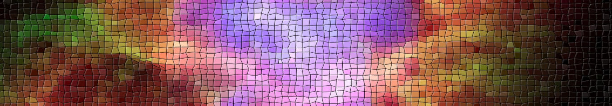

# PlasmaTorch: A Python-Based Particle-in-Cell Simulator

PlasmaTorch is an advanced Particle-in-Cell (PIC) simulation framework tailored for researchers, educators, and enthusiasts in plasma physics and computational modeling. Built in Python and leveraging the power of PyTorch, PlasmaTorch delivers high-performance simulations with GPU acceleration, while maintaining a modular and user-friendly design. 

Designed with both education and innovation in mind, PlasmaTorch is an ideal platform for exploring plasma dynamics, experimenting with novel algorithms, and integrating AI-driven techniques into scientific simulations.

## Key Features

### High-Performance Simulation
- **Particle-in-Cell (PIC) Engine:** Accurately simulates particle interactions and electromagnetic field evolution.
- **GPU-Accelerated:** Harnesses PyTorch for lightning-fast computation on CUDA-enabled devices.
- **Customizable Boundary Conditions:** Supports reflecting, absorbing, and user-defined boundary types to adapt to diverse simulation needs.

### AI and Neural Network Integration
- **AI-Ready:** Prepares for integration with deep learning models and reinforcement learning algorithms for advanced control and predictive capabilities.
- **PyTorch Backend:** Seamless incorporation of AI tools and techniques, opening pathways to cutting-edge research.

### Advanced Physics Modeling (v 0.1)
- **Poisson Solvers:** Multiple solvers (Jacobi, Gauss-Seidel, Red-Black Gauss-Seidel) for versatile electric potential computation.
- **Dynamic Magnetic Fields:** Define constant or variable magnetic fields for advanced plasma behavior studies.
- **Energy Tracking:** Real-time monitoring of kinetic, potential, and total mechanical energies.
- **Object Interaction:** Introduces customizable solid objects with specific surface and potential properties.

## Examples
- [**Introduction**](examples/example1.ipynb)
- [**Plasma Frequency** ](examples/example2.ipynb)
- [**Single Particle in a Constant Electric Field**](examples/example3.ipynb)
- [**Single-Particle Gyromotion in a Constant Magnetic Field**](examples/example4.ipynb)
- [**Two-Stream Instability**](examples/example5.ipynb)

## Installation

### Prerequisites
- Python 3.8 or higher
- GPU with CUDA support (optional, but recommended)
- Required Python libraries:
  - `torch`
  - `numpy`
  - `tqdm`
  - `h5py`

### Steps
1. Clone this repository:
   ```bash
   git clone https://github.com/p0six-00/PlasmaTorch.git
   cd PlasmaTorch
   ```
2. Install dependencies:
   ```bash
   pip install -r requirements.txt
   ```

## Getting Started

### Example: Running a Simple Simulation
```python
from PlasmaTorch import PlasmaTorch

# Initialize the simulation
simulation = PlasmaTorch(
    simulation_name="example_simulation",
    Lx=10, Ly=10,
    Nx=100, Ny=100,
    simulation_time=10.0,
    dt=0.01,
    boundaries_type="reflecting",
    save_frequency=10,
    seed=42,
    verbose=True
)

# Add a species
simulation.create_new_specie(
    name="electrons",
    num_particles=10000,
    temperature=1.0,
    distribution="maxwell-boltzmann",
    mass=9.11e-31,
    charge=-1.6e-19,
    disposition="random"
)

# Run the simulation
simulation.simulate()
```

### Adding a Magnetic Field
```python
simulation.define_constant_magnetic_field(x_min=2, x_max=8, y_min=2, y_max=8, bz=0.1)
```

### Adding Rectangular Objects
```python
simulation.add_rectangle_object(x_min=1, x_max=3, y_min=1, y_max=3, solid=True, type="reflecting", potential=5.0)
```

## Future Implementations
PlasmaTorch is an evolving project with plans to include the following advanced features:

1. **Advanced Collisional Models:**
   - Implementation of Monte Carlo Collision (MCC) models.
   - Integration of Boltzmann collision operators for high-fidelity simulations.

2. **Electromagnetic Field Solvers:**
   - Full-resolution solvers for Maxwell's equations.
   - Support for time-varying electromagnetic fields and wave propagation.

3. **Laser and Electromagnetic Sources:**
   - Integration of laser sources for plasma interaction studies.
   - Capability to model external field sources with precise control over frequency and intensity.

4. **Ionization Models:**
   - Inclusion of impact ionization and field ionization processes.
   - Advanced tracking of ionization rates and species generation.

5. **Expanded Boundary Conditions:**
   - Enhanced support for open and periodic boundary conditions.
   - Modeling of sheath formation and plasma-wall interactions.

6. **Plasma Chemistry:**
   - Multi-species interactions with complex reaction networks.
   - Support for plasma-surface chemistry.

7. **Visualization Tools:**
   - Real-time plotting and animation of field and particle data.
   - Advanced post-processing tools for detailed analysis.

8. **Hybrid PIC Models:**
   - Incorporation of fluid-PIC hybrid models for computational efficiency in large-scale simulations.

## Contributions
Contributions are welcome! Whether it's bug fixes, new features, or documentation improvements, feel free to submit a pull request or open an issue.

## License
This project is licensed under the MIT License. See the [LICENSE](LICENSE) file for details.

---

PlasmaTorch: Simplicity and power for plasma simulation, made for students, researchers, and the future of AI-driven physics!
